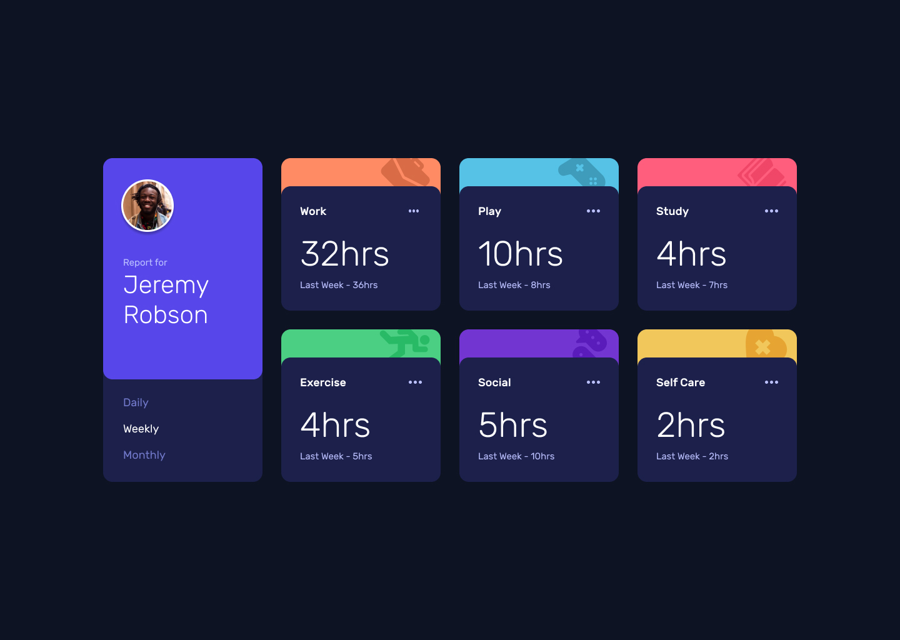

## Time Dashboard
[Github Pages live](https://alexcumplido.github.io/frontend-mentor/time-dashboard/) | [Frontend Mentor solution](https://www.frontendmentor.io/solutions/javascript-modal-styled-label-as-input-same-effect-qZiNNHmwZX)

### Table of contents
- [User flow](#user-flow)
- [Screenshot](#screenshot)
- [Run project](#run-project)
- [Built with](#built-with)
- [Thoughts](#thoughts)

#### User flow
- Switch between viewing Daily, Weekly, and Monthly stats
- See hover states for all interactive elements on the page
- View the optimal layout for the app depending on their device's screen size

#### Screenshot


#### Run project
```
# Just a local development server
```

#### Built with
- Semantic HTML5 markup
- CSS custom properties
- JavaScript
- Mobile-first workflow

#### Thoughts
In tried to keep printDashboardData(time) as short as possible, once the user click on any time frame button the inner text of that button (daily, weekly, monthly) is the argument that we use to call printDashboardData(print). Once the function body starts executing we iterate over the array of objects from the fetched JSON and by destructuring assignment we pull out the values that our UI require for switching timeframes dat

I tried to keep as well the source of truth in the JSON data, for that reason I create a CSS class from the field `"title"` and then attach this class to all the `<article>`, therefore in each iteration now we will have acess to all the DOM Nodes inside each card and we are able to inyect the required data for each field.

```js
for (let i = 0; i < timeframes.length; i++) {
    timeframes[i].addEventListener('click', function (event) {
        let time = event.target.innerText.toLowerCase();
        printDashboardData(time);
    })
}

function printDashboardData(time) {
    for (let i = 0; i < dataFetched.length; i++) {

        let { current: currentValue, previous: previousValue } = dataFetched[i].timeframes[time];

        let itemTitle = dataFetched[i].title.toLowerCase().replace(' ', '-');
        cards[i].classList.add(itemTitle);
        let cardTitle = document.querySelector(`.${itemTitle} .card-title`);
        let currentCada = document.querySelector(`.${itemTitle} .card-current-data`);
        let previousData = document.querySelector(`.${itemTitle} .card-previous-data`);

        cardTitle.innerText = dataFetched[i].title;
        currentCada.innerText = `${String(currentValue)}hrs`;
        previousData.innerText = `Last ${getPastWordTime(time)} - ${String(previousValue)}hrs`;
    }
}
```
